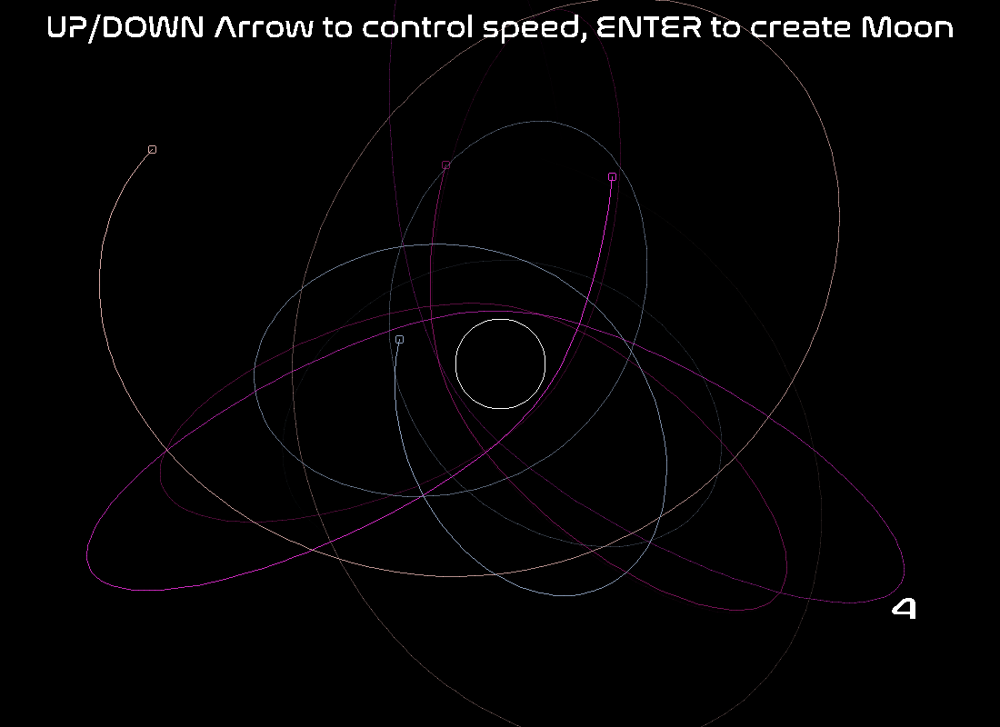
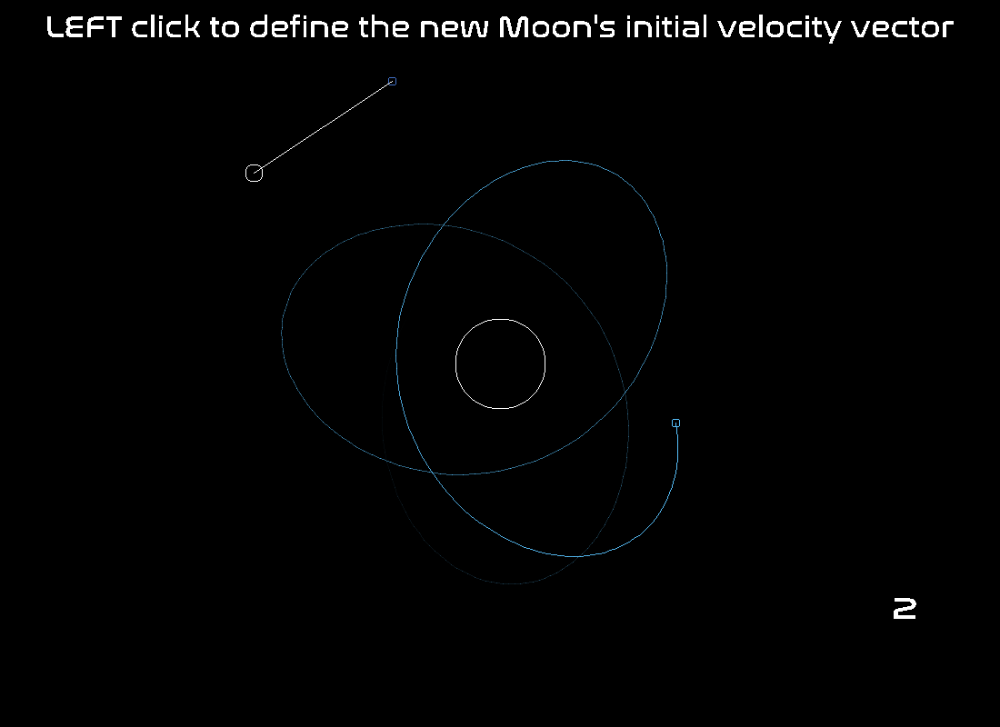
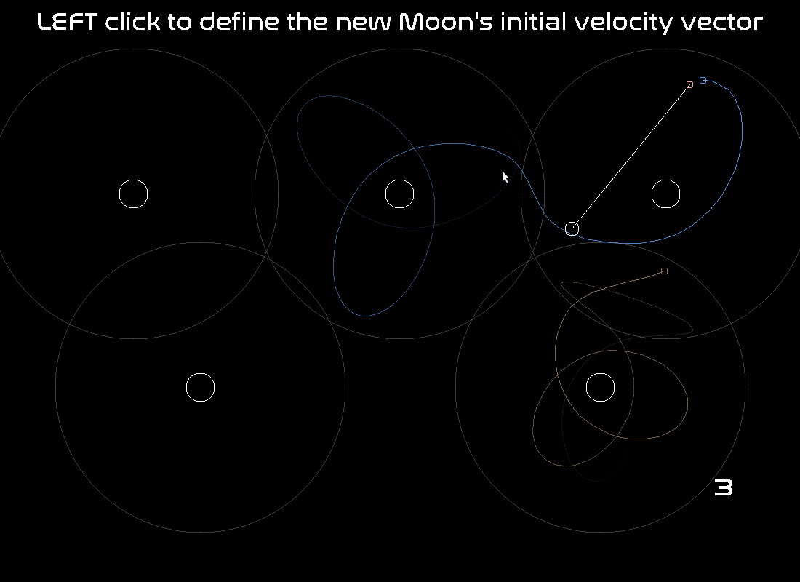

# MoonJam: Orbital physics simulator

Create new Moons and send them orbiting around planets. Meditate watching them moving through your universe, or try to see how many stable orbits you can keep on a 5 planets system!

## Controls
1. Use the mouse to click and give an initial velocity to your Moon
2. Once in orbit, you can control the last Moon's velocity with UP and DOWN arrow
   1. Tip: try and circularize your orbit by braking at the closest/fastest point (apogea) or accelerating at the furthest/fastest point (perigea)
   2. Careful! You'll lose your Moon if it crashes into a planet or wanders too far of screen
3. Once you are satisfied with your orbit, press ENTER to create a new Moon

## Dependencies for Running Locally
* cmake >= 3.7
  * All OSes: [click here for installation instructions](https://cmake.org/install/)
* make >= 4.1 (Linux, Mac), 3.81 (Windows)
  * Linux: make is installed by default on most Linux distros
  * Mac: [install Xcode command line tools to get make](https://developer.apple.com/xcode/features/)
  * Windows: [Click here for installation instructions](http://gnuwin32.sourceforge.net/packages/make.htm)
* SDL2 >= 2.0
  * All installation instructions can be found [here](https://wiki.libsdl.org/Installation)
  * Note that for Linux, an `apt` or `apt-get` installation is preferred to building from source.
* gcc/g++ >= 5.4
  * Linux: gcc / g++ is installed by default on most Linux distros
  * Mac: same deal as make - [install Xcode command line tools](https://developer.apple.com/xcode/features/)
  * Windows: recommend using [MinGW](http://www.mingw.org/)
* SDL_TTF
  * https://www.libsdl.org/projects/SDL_ttf/

## Basic Build Instructions

1. Clone this repo.
2. Make a build directory in the top level directory: `mkdir build && cd build`
3. Compile: `cmake .. && make`

## Launch simulation
1. From your build directory, run `./MoonJam`
2. Run with multiple planets: `./MoonJam 4` (argument from 1 to 5 included)

## Code Structure
* Universe class: Contains the main simulation parameters and loop, as well as the data structure handles
* SpaceBody: Parent virtual class for all space bodies. Children:
  * Moon class: Moon simulation, motion physics
  * Planet class: Acceleration physics
* Graphics class: Helper for drawing methods
* Point class: helper for physics vectors

* Universe::Universe() creates the initial data
* Univers::run() starts the main sim loop, starts the display, and handles the timing 
* Moon::updateState() is the main motion physics simulator
* Planet::computeAccelerationComponent() calculates the gravitational force of each planet on a Moon

## Rubric Completion
* The project demonstrates an understanding of C++ functions and control structures.
  * **Everywhere**
* The project accepts user input and processes the input.
  * **src/universe.cpp:120 and after**
* The project uses Object Oriented Programming techniques.
  * **Everywhere**
* Class constructors utilize member initialization lists.
  * **src/space_body.h:8**
* Classes follow an appropriate inheritance hierarchy.
  * **Moon : SpaceBody | Planet : SpaceBody**
* Overloaded functions allow the same function to operate on different parameters. AND
* Derived class functions override virtual base class functions.
  * **src/moon.cpp:70**
* The project uses smart pointers instead of raw pointers.
  * **src/universe.h:36 and 37